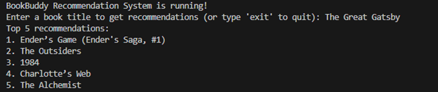

# BookBuddy: AI-Powered Book Recommendation System

**BookBuddy** is a book recommendation system that utilizes web scraping, natural language processing, and machine learning to provide personalized book recommendations. This project scrapes data from Goodreads, processes it using TF-IDF vectorization, and computes cosine similarity to suggest similar books based on user input.

## Features

- Scrapes book titles, authors, and descriptions from Goodreads.
- Uses TF-IDF vectorization to process book data.
- Computes cosine similarity to identify and recommend books with similar content.
- Console-based interaction for real-time recommendations.

## What I Learned

Through this project, I enhanced my skills in:
- **Web Scraping**: Using `requests` and `BeautifulSoup` to extract data from websites.
- **Data Preprocessing**: Cleaning and combining text data for effective processing.
- **Machine Learning Techniques**: Implementing TF-IDF and cosine similarity for text-based recommendations.
- **Concurrency**: Speeding up web scraping with Python's `ThreadPoolExecutor`.
- **System Design**: Building a cohesive pipeline from data extraction to recommendation.

## Sample Output

Below is a sample output from the recommendation system:



## How to Run

1. Clone the repository.
   ```bash
   git clone https://github.com/Swyampatel/BookBuddy-AI-Powered-Book-Recommendation-System.git
   ```
2. Navigate to the project folder.
   ```bash
   cd BookBuddy
   ```
3. Install dependencies.
   ```bash
   pip install -r requirements.txt
   ```
4. Run the script.
   ```bash
   python bookbuddy.py
   ```
5. Enter a book title to get recommendations or type `exit` to quit.

## Future Enhancements

- Integrate advanced AI techniques like Word2Vec or BERT for better recommendations.
- Build a web interface using Flask or React for enhanced user interaction.
- Add support for user ratings and collaborative filtering.

---
Please feel free to reach out if you have any questions or need clarification regarding the project. I’d be happy to assist!
